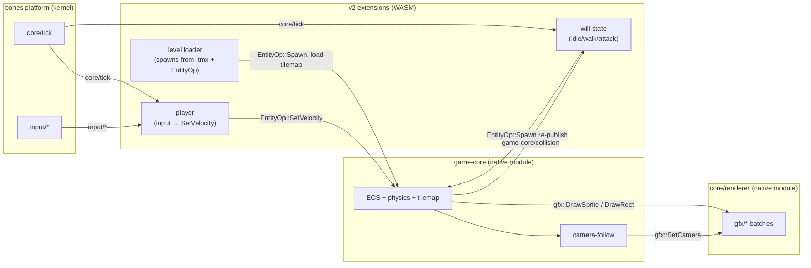

# Architecture (draft)

Status: draft — sketches the intended shape of the v2 reimplementation before
any real level exists. Expect this to change once `extensions/hello` grows
into an actual player/level and the plan meets reality. Not yet held to
[bones' own altitude rule](../vendor/bones/docs/index.md) (behavior/boundaries,
not code) since nothing below is built yet — tighten once it is.

## Why a v2

[artificial-will-game](https://github.com/an-dr/artificial-will-game) (a
robot named Will overcoming obstacles) was a C++/SDL2/EnTT engine written
from scratch: its own `World`/`registry`, hand-rolled systems for input,
movement+collision, camera, state, rendering. `bones` already provides a
native `game-core` module — ECS, physics/collision (two swappable backends),
Tiled tilemap loading, sprite-animation timing, camera-follow with level-edge
clamping — covering most of what that hand-rolled engine did. v2 targets
that module instead of rebuilding it, and keeps only what's actually
game-specific (Will's own behavior) as WASM extensions on top.

## Old → new mapping

| v1 (C++, hand-rolled) | v2 (bones) |
| --- | --- |
| `World` (`registry_`, `TileMap`, `CameraState`) | `game-core` native module (`vendor/bones/core/game-core`) |
| `ComponentGeometry`, `ComponentSpriteRendering`, `ComponentCollider`, `ComponentType` | `EntityOp::Spawn` fields (`game-core/entity-op`) |
| `TileMap` (own parser) | `game-core/load-tilemap` (Tiled `.tmx`, `"Collision"`/`"Ground"` layers) |
| `SystemMovementAndCollision` | `game-core`'s own physics step (`rapier2d` or retro backend) |
| `SystemCamera` + `CameraState` (follow + world-bounds clamp) | `EntityOp::SetCameraFollow`, already clamped to level size |
| `SystemRendering` + `GpuAssetManager` | `core/renderer` executing `gfx/*` batches — `game-core` emits these, nothing draws directly |
| `SystemInput` + `ComponentInput` | an extension reading `input/*`, issuing `EntityOp::SetVelocity` |
| `SystemState` + `IStateMachine` (`ComponentState`) | **not yet covered by bones** — stays a v2 extension (see below) |
| `ComponentPlayer`, `player_one.hpp`, `level_one.hpp` | game-specific extensions + one or more `.tmx` levels |

## Top level

Everything left of "Extensions" is bones as-is, unmodified. Everything in
"Extensions" is what v2 actually builds.

## Open questions

- **State machine.** v1's `SystemState`/`IStateMachine` (per-entity states
  driving animation/behavior, e.g. idle → walk → attack) has no bones
  equivalent yet. Candidate shapes: a single extension owning all of Will's
  states and re-publishing `EntityOp::Spawn` with a different sprite/atlas
  on transition, vs. proposing a generic state concept upstream in
  `game-core` (an ADR-sized decision, not a v2-local one). Default plan is
  the former until it proves too limiting.
- **Attack / combat.** No v1 equivalent existed either (`attack_pressed` was
  read but never wired to a system) — combat is net-new design, not a port.
- **Which physics backend.** `rapier2d` (real physics, momentum) vs. the
  retro backend (arcade-feel, no momentum) — v1 was arcade-feel by
  construction (no physics engine at all). Retro is the closer match;
  confirm once movement is actually playable.
- **Audio.** v1 had none. `core/audio` (bones) is available whenever the
  game wants footstep/hit sounds — see
  `vendor/bones/extensions/game_core_demo` for the pattern.

## Current state

The `game` package (root `Cargo.toml`/`src/`) embeds `bones` directly as
path dependencies (`runner`, `game-core`) and already registers `game-core`
as a module — but only [`extensions/hello`](../extensions/hello) exists as
actual WASM content today, a smoke-test proving the toolchain works end to
end (`cargo run --release` builds engine + extensions in one command via
root `build.rs`; see root [README.md](../README.md)). No level, no player,
no real `game-core` usage yet.
