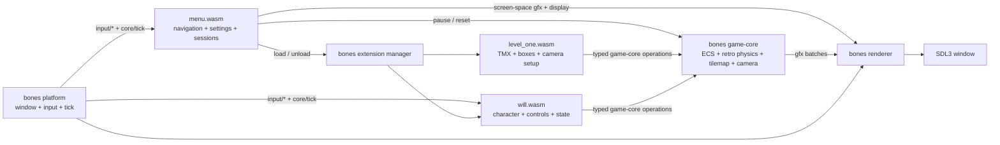

# Architecture

Artificial Will v2 keeps the original game's level and character behavior
while replacing its hand-rolled C++ engine with bones. Native modules own
platform access and reusable 2D facilities; separate WASM components own the
level and character rules.

## System boundary

The root `game` binary embeds the bones runner, renderer, and game-core
modules. It starts only `menu`; the menu is the sole authorized runtime
extension controller and loads `level_one` plus `will` after selection.
Returning home unloads both and resets game-core, while Escape pauses the
native simulation and Will's own behavior without destroying the session.
Each gameplay component embeds its own TMX or image bytes, so runtime behavior
does not depend on a working directory or loose asset paths.

## Engine and game ownership

Bones owns entity storage, the retro physics world, tilemap rendering, sprite
animation timing, scaled and mirrored presentation, and clamped smooth camera
follow. The port added the generally reusable `SetSprite`, camera-smoothing,
and four/eight-direction `ObjectFacing` capabilities to bones; presentation
wire compatibility and behavior are documented in the engine's ADR-023.

The `level_one` component owns its TMX, tileset, boxes, and camera setup through
game-core operations. The `will` component owns character assets and spawning,
held controls, and the idle/walk/attack state machine. Its bindings are
isolated from the pure state modules, and it uses bones `ObjectFacing` in
cardinal mode to preserve v1 behavior. Switching animation changes presentation
in place and never replaces Will's transform or collider.

The persistent `menu` component owns start, pause, settings, and level-selection
screens. It renders them as screen-space rectangles and text through the game
renderer, performs mouse hit-testing in the same logical canvas, and consumes
keyboard navigation directly. It queries display modes from the native host,
applies resolution and fullscreen changes through typed renderer messages, and
stores a strict versioned preference record through bones persistence.

## Fidelity to v1

Level one is a 16×16 Tiled map using the original 64-pixel grass tiles and the
same six non-default cells. Will and the three pushable boxes retain their
original drawn sizes, hitboxes, and starting positions. Movement remains 160
pixels per second on each axis without diagonal normalization.

Will chooses facing from the dominant movement axis, mirrors the side sheet
only when facing right, and uses the original five-frame 8 fps idle/walk
animations. Space starts the original two-frame visual attack on a press edge;
movement continues and facing freezes until it finishes. The original has no
attack damage or audio behavior, so the port does not invent either.

## Assets and packaging

The repository-level `assets/` directory is a byte-for-byte copy of every
asset tracked by v1, including upstream license and source-package files.
`cargo build` also builds the WASM workspace. `cargo xtask dist` selects the
workspace's current `cdylib` targets and validated distribution groups from
Cargo metadata. It produces the executable with `core/menu.wasm`,
`core/will.wasm`, and `levels/level_one.wasm`, preventing removed, stale, or
ungrouped artifacts from leaking into a distribution.
