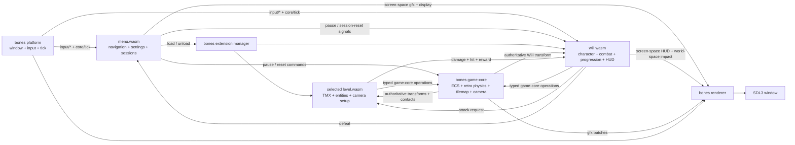

# Architecture

Artificial Will v2 keeps the original game's level and character behavior
while replacing its hand-rolled C++ engine with bones. Native modules own
platform access and reusable 2D facilities; separate WASM components own the
level and character rules.

## System boundary

The root `game` binary embeds the bones runner, renderer, and game-core
modules. It starts only `menu`; the menu is the sole authorized runtime
extension controller and loads the selected level plus `will` after selection.
Returning home unloads both and resets game-core, while Escape pauses the
native simulation and Will's own behavior without destroying the session.
Each gameplay component embeds its own TMX or image bytes, so runtime behavior
does not depend on a working directory or loose asset paths.

## Engine and game ownership

Bones owns entity storage, the retro physics world, tilemap rendering, sprite
animation timing, scaled and mirrored presentation, and clamped smooth camera
follow. The port added the generally reusable `SetSprite`, camera-smoothing,
and four/eight-direction `ObjectFacing` capabilities to bones; presentation
wire compatibility and behavior are documented in the engine's ADR-023.

Each level component owns its TMX, tileset, entities, camera setup, and target
health through game-core operations. Level One preserves the original grass
field and pushable boxes; boxes track their authoritative moved positions,
break in one hit, and award deterministic coins. Level Two supplies mixed
grass and broken-stone ruins, illustrated fixed rock obstacles, and
idle-animated slime colliders. Slimes pursue Will only inside a bounded
awareness radius, deal damage on contact starts, take two hits, and award XP
only on death. Dead entities leave targeting, motion, and contact behavior
before their idempotent game-core despawn is published.

The `will` component owns character assets and spawning, held controls, the
idle/walk/attack state machine, three session lives, damage invulnerability,
coins, XP, derived level, and defeat signaling. It builds each melee request
from game-core's latest authoritative Will transform; the active level selects
at most one nearest target in the directional lane and confirms the result.
Will renders a compact screen-space HUD through bones' theme-free `game-ui`
primitives and a brief world-space marker after confirmation. Its bindings are
isolated from pure state modules, and it uses bones `ObjectFacing` in cardinal
mode to preserve v1 presentation behavior. Switching animation changes
presentation in place and never replaces Will's transform or collider.

The persistent `menu` component owns start, pause, settings, and level-selection
screens. It renders them as screen-space rectangles and text through the game
renderer, performs mouse hit-testing in the same logical canvas, and consumes
keyboard navigation directly. Shared theme-free layout and interaction
mechanics come from bones `game-ui`; Artificial Will retains its colors,
labels, and navigation state. It queries display modes from the native host,
applies resolution and fullscreen changes through typed renderer messages,
and stores a strict versioned preference record through bones persistence.
It also consumes Will's authenticated defeat event and expresses restart as
the same transactional level-replacement request used by manual switching:
pause, unload, reset game-core, reload the same level and Will, then resume.

## Fidelity to v1

Level one is a 16×16 Tiled map using the original 64-pixel grass tiles and the
same six non-default cells. Will and the three pushable boxes retain their
original drawn sizes, hitboxes, and starting positions. Movement remains 160
pixels per second on each axis without diagonal normalization.

Will chooses facing from the dominant movement axis, mirrors the side sheet
only when facing right, and uses the original five-frame 8 fps idle/walk
animations. Space starts the original two-frame visual attack on a press edge;
movement continues and facing freezes until it finishes. Combat, lives,
session progression, destructible rewards, hostile slime pursuit, and the HUD
are deliberate v2 gameplay additions layered on that original presentation;
audio, equipment, shops, randomized loot, ranged attacks, and persistent
cross-session progression remain out of scope.

## Assets and packaging

The repository-level `assets/` directory is a byte-for-byte copy of every
asset tracked by v1, including upstream license and source-package files.
`cargo build` also builds the WASM workspace. `cargo xtask dist` selects the
workspace's current `cdylib` targets and validated distribution groups from
Cargo metadata. It produces the executable with
`extensions/core/menu.wasm`, `extensions/core/will.wasm`,
`extensions/levels/level_one.wasm`, and
`extensions/levels/level_two.wasm`, preventing removed, stale, or ungrouped
artifacts from leaking into a distribution or unrelated executable
directories from entering extension discovery.
