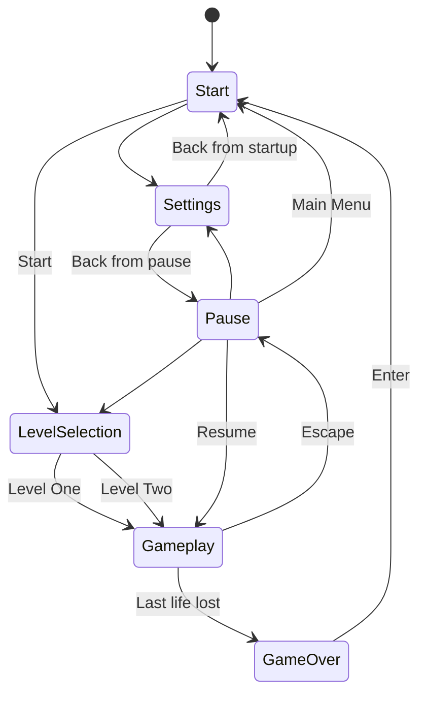

# Menu and level lifecycle

The game uses bones' runtime-managed extension activation
([ADR-024](../../vendor/bones/docs/adr/ADR-024-runtime-managed-extension-activation.md))
to keep navigation in WASM while loading only the selected gameplay content.

## Ownership

| Owner | Responsibility |
| --- | --- |
| `menu.wasm` | Screen state, navigation, display preferences, and lifecycle requests |
| bones extension manager | Recursive catalog, startup allow-list, load/unload/reload, and lifecycle results |
| `will.wasm` | Character resources, entity, input, and cleanup |
| `level_one.wasm` | Level resources, entities, camera, and cleanup |
| `level_two.wasm` | Mixed grass/stone ruins, illustrated rocks, proactive attacking slimes, camera, and cleanup |
| native `game-core` | Simulation, rendering, pause, and world reset |

The menu is the only startup extension. Gameplay extensions are cataloged but
remain uninstantiated until a level is selected.

## Screens



Start provides Start, Settings, and Quit. Pause provides Resume, Settings,
Level Selection, Main Menu, and Quit. Game Over pauses the finished session and
prompts for Enter to return to Start. The menu draws game-native screen-space
graphics through the renderer and handles mouse hit-testing plus arrow/WASD
selection and Enter/Space activation directly from the input bus.

## Session transitions

Starting a level loads the selected level extension followed by `will`, then
unpauses `game-core`. Changing levels pauses simulation, unloads `will` and the
current level, resets the native world, and loads the new pair. Returning to
the start screen performs the same unload and reset without loading a
replacement.

Defeat pauses the current session without unloading it so the game-over screen
has a stable world behind it. Enter returns to Start through the normal stop
transition, unloading Will and the active level before resetting the world.

`shutdown` lets each gameplay extension publish cleanup for the resources and
entities it created. The world reset is a defensive session boundary, not a
replacement for extension cleanup.

Esc pauses native simulation and character behavior without unloading either
gameplay extension, preserving the exact session for Resume. The menu keeps
receiving frame ticks and publishing its game-rendered overlay while gameplay
is paused. Game-owned `game/pause-changed` and `game/session-reset` signals
notify gameplay listeners; `game-core/entity-op` remains a command channel
with only game-core as its reader.

## Display preferences

The settings screen lists the display modes reported by bones, falling back to
800×600 if none are available. It applies resolution and fullscreen/windowed
mode immediately through `gfx/set-display`.

`menu.wasm` stores a versioned preference record through bones persistence.
Missing, corrupt, or unsupported saved values fall back safely and are
rewritten after the user selects a valid setting.

## Distribution

```text
dist/
├── artificial-will[.exe]
└── extensions/
    ├── core/
    │   ├── menu.wasm
    │   └── will.wasm
    └── levels/
        ├── level_one.wasm
        └── level_two.wasm
```

Cargo package metadata assigns each component its distribution group. The
packager rejects missing or unknown groups rather than silently flattening an
artifact. Runtime discovery is confined to the dedicated `extensions/` root.
